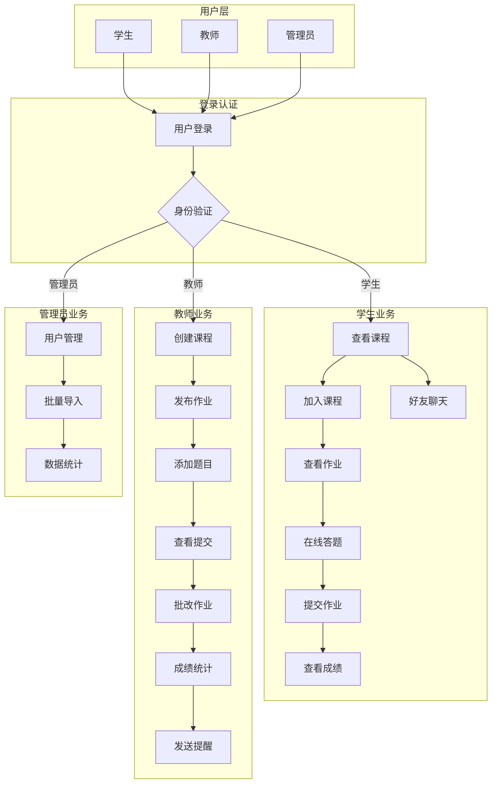
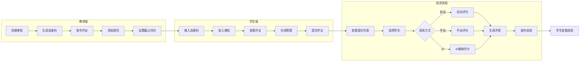
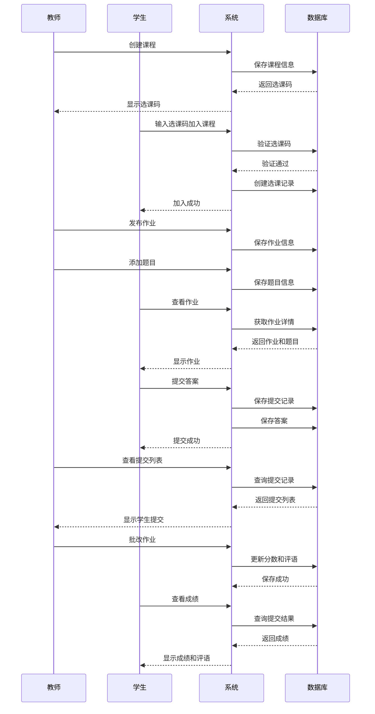
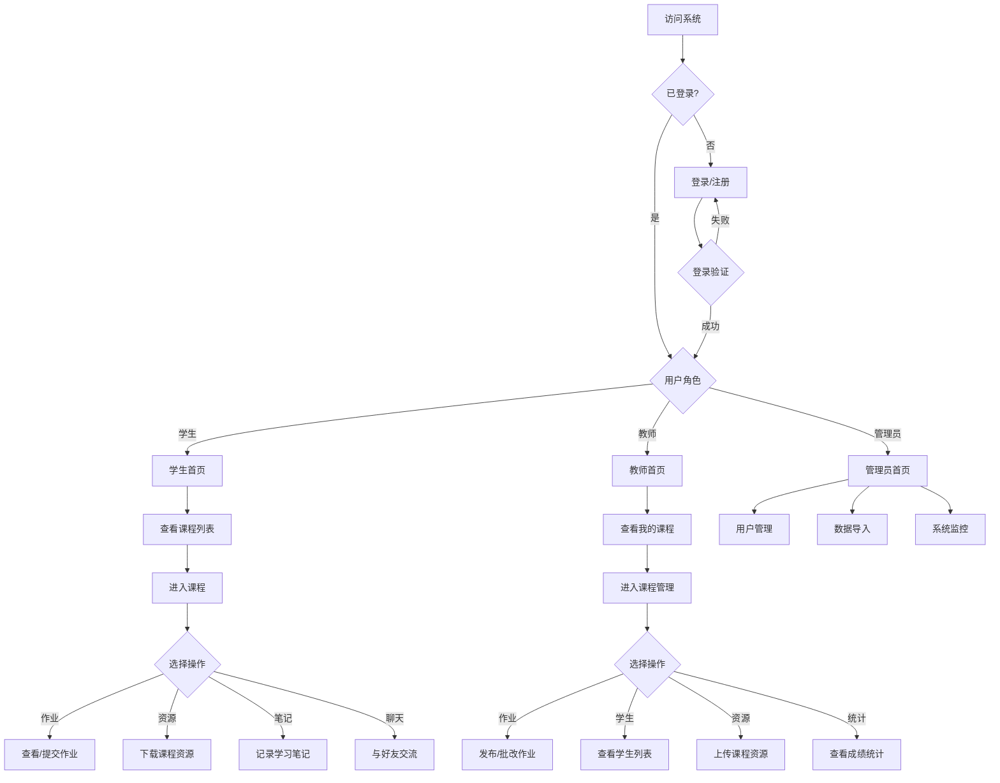
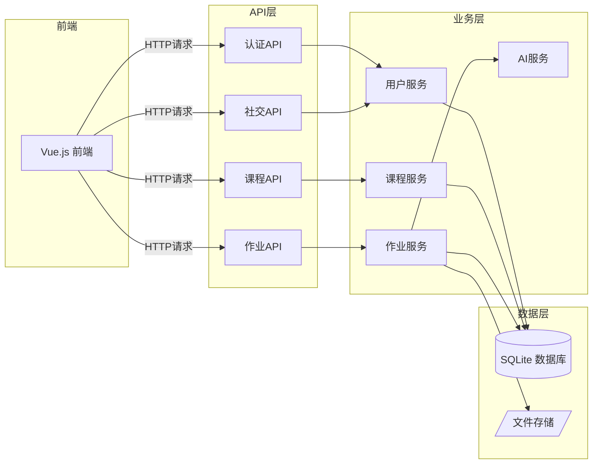
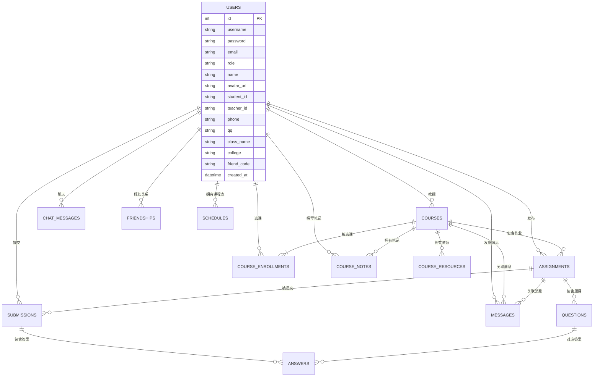
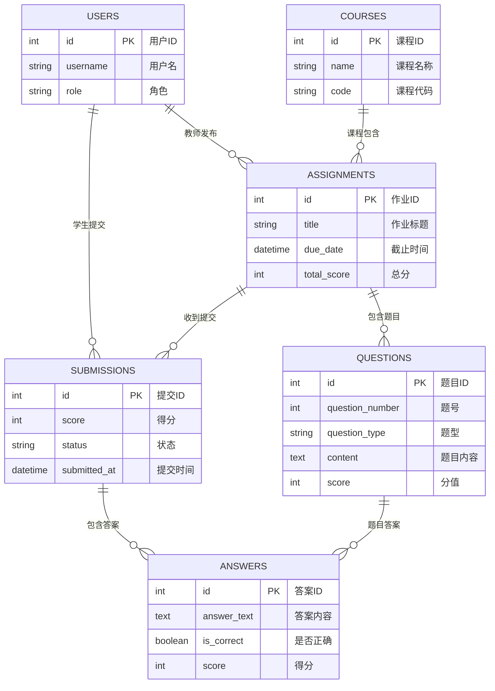
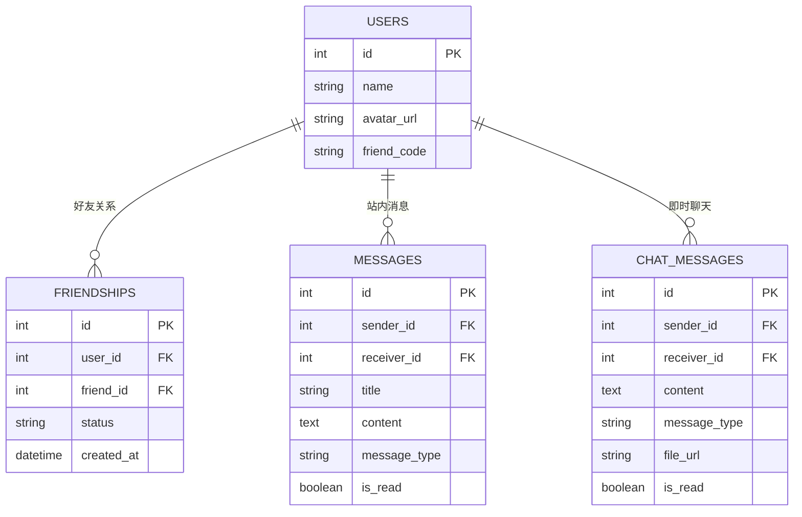
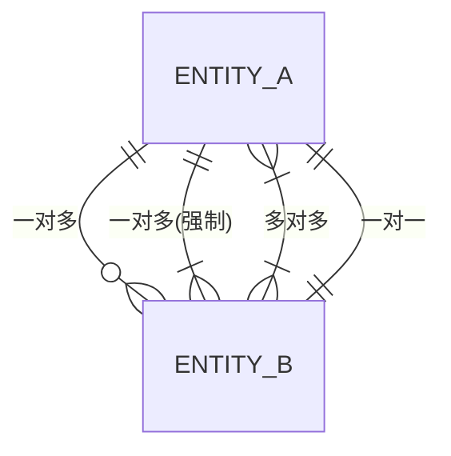

# 作业管理系统 - 数据库设计文档

## 一、系统概述

本系统是一个面向高校的作业管理系统，支持教师发布作业、学生提交作业、在线批改、课程管理、好友社交等功能。

### 主要功能模块

| 模块 | 功能描述 |
|------|----------|
| 用户管理 | 教师、学生、管理员三类用户，支持登录注册、个人信息管理 |
| 课程管理 | 课程创建、选课、课程资源、课程笔记 |
| 作业管理 | 作业发布、题目管理、在线答题、作业提交 |
| 批改系统 | 在线批改、成绩评定、反馈评语 |
| 社交功能 | 好友系统、私信聊天、消息通知 |
| 课程表 | 个人课程表管理 |

---

## 二、系统业务流程图

### 2.1 系统整体业务流程图



### 2.2 核心业务流程 - 作业管理



### 2.3 作业提交与批改详细流程



### 2.4 用户交互流程图



### 2.5 数据流转图



---

## 三、数据库ER图

### 3.1 整体ER图



### 3.2 核心业务ER图（作业提交流程）



### 3.3 社交模块ER图



---

## 四、数据表设计

### 4.1 用户表

**表名：** `users`

**描述：** 存储系统所有用户信息，包括教师、学生和管理员

| 字段名 | 数据类型 | 长度 | 约束 | 默认值 | 说明 |
|--------|----------|------|------|--------|------|
| id | INT | - | PRIMARY KEY, AUTO_INCREMENT | - | 用户ID |
| username | VARCHAR | 80 | NOT NULL, UNIQUE | - | 登录用户名 |
| password | VARCHAR | 200 | NOT NULL | - | 密码（加密存储） |
| email | VARCHAR | 120 | NOT NULL, UNIQUE | - | 邮箱地址 |
| role | VARCHAR | 20 | NOT NULL | - | 角色 |
| name | VARCHAR | 100 | NOT NULL | - | 真实姓名 |
| avatar_url | VARCHAR | 500 | NULL | - | 头像URL |
| student_id | VARCHAR | 20 | NULL | - | 学号（学生） |
| teacher_id | VARCHAR | 20 | NULL | - | 工号（教师） |
| phone | VARCHAR | 20 | NULL | - | 手机号 |
| qq | VARCHAR | 20 | NULL | - | QQ号 |
| class_name | VARCHAR | 100 | NULL | - | 班级名称 |
| college | VARCHAR | 100 | NULL | - | 学院 |
| friend_code | VARCHAR | 10 | NULL | - | 好友码 |
| created_at | DATETIME | - | - | CURRENT_TIMESTAMP | 创建时间 |

**索引设计：**
- PRIMARY KEY: `id`
- UNIQUE INDEX: `username`, `email`

---

### 4.2 课程表

**表名：** `courses`

**描述：** 存储课程基本信息

| 字段名 | 数据类型 | 长度 | 约束 | 默认值 | 说明 |
|--------|----------|------|------|--------|------|
| id | INT | - | PRIMARY KEY, AUTO_INCREMENT | - | 课程ID |
| name | VARCHAR | 100 | NOT NULL | - | 课程名称 |
| code | VARCHAR | 20 | NOT NULL, UNIQUE | - | 课程代码（选课码） |
| code_expiry | DATETIME | - | NULL | - | 选课码过期时间 |
| teacher_id | INT | - | FOREIGN KEY, NOT NULL | - | 授课教师ID |
| description | TEXT | - | NULL | - | 课程描述 |
| class_name | VARCHAR | 100 | NULL | - | 授课班级 |
| expected_students | INT | - | NULL | - | 预期学生数 |
| created_at | DATETIME | - | - | CURRENT_TIMESTAMP | 创建时间 |

**外键约束：**
- `teacher_id` REFERENCES `users(id)`

---

### 4.3 选课表 (course_enrollments)

**表名：** `course_enrollments`

**描述：** 学生选课关系表（多对多中间表）

| 字段名 | 数据类型 | 长度 | 约束 | 默认值 | 说明 |
|--------|----------|------|------|--------|------|
| id | INT | - | PRIMARY KEY, AUTO_INCREMENT | - | 记录ID |
| course_id | INT | - | FOREIGN KEY, NOT NULL | - | 课程ID |
| student_id | INT | - | FOREIGN KEY, NOT NULL | - | 学生ID |
| joined_at | DATETIME | - | - | CURRENT_TIMESTAMP | 加入时间 |

**外键约束：**
- `course_id` REFERENCES `courses(id)`
- `student_id` REFERENCES `users(id)`

**唯一约束：**
- UNIQUE(`course_id`, `student_id`) - 防止重复选课

---

### 4.4 课程资源表 (course_resources)

**表名：** `course_resources`

**描述：** 存储课程的各类资源文件

| 字段名 | 数据类型 | 长度 | 约束 | 默认值 | 说明 |
|--------|----------|------|------|--------|------|
| id | INT | - | PRIMARY KEY, AUTO_INCREMENT | - | 资源ID |
| course_id | INT | - | FOREIGN KEY, NOT NULL | - | 课程ID |
| title | VARCHAR | 200 | NOT NULL | - | 资源标题 |
| description | TEXT | - | NULL | - | 资源描述 |
| url | VARCHAR | 500 | NOT NULL | - | 资源URL |
| file_type | VARCHAR | 50 | NULL | - | 文件类型 |
| file_size | INT | - | NULL | - | 文件大小(字节) |
| file_name | VARCHAR | 255 | NULL | - | 原始文件名 |
| created_at | DATETIME | - | - | CURRENT_TIMESTAMP | 上传时间 |

**外键约束：**
- `course_id` REFERENCES `courses(id)` ON DELETE CASCADE

---

### 4.5 课程笔记表 (course_notes)

**表名：** `course_notes`

**描述：** 学生在课程中的学习笔记

| 字段名 | 数据类型 | 长度 | 约束 | 默认值 | 说明 |
|--------|----------|------|------|--------|------|
| id | INT | - | PRIMARY KEY, AUTO_INCREMENT | - | 笔记ID |
| course_id | INT | - | FOREIGN KEY, NOT NULL | - | 课程ID |
| student_id | INT | - | FOREIGN KEY, NOT NULL | - | 学生ID |
| title | VARCHAR | 200 | NOT NULL | - | 笔记标题 |
| content | TEXT | - | NOT NULL | - | 笔记内容 |
| created_at | DATETIME | - | - | CURRENT_TIMESTAMP | 创建时间 |
| updated_at | DATETIME | - | - | CURRENT_TIMESTAMP | 更新时间 |

**外键约束：**
- `course_id` REFERENCES `courses(id)` ON DELETE CASCADE
- `student_id` REFERENCES `users(id)`

---

### 4.6 作业表

**表名：** `assignments`

**描述：** 存储教师发布的作业信息

| 字段名 | 数据类型 | 长度 | 约束 | 默认值 | 说明 |
|--------|----------|------|------|--------|------|
| id | INT | - | PRIMARY KEY, AUTO_INCREMENT | - | 作业ID |
| title | VARCHAR | 200 | NOT NULL | - | 作业标题 |
| description | TEXT | - | NULL | - | 作业描述 |
| due_date | DATETIME | - | NOT NULL | - | 截止时间 |
| teacher_id | INT | - | FOREIGN KEY, NOT NULL | - | 发布教师ID |
| course_id | INT | - | FOREIGN KEY, NULL | - | 所属课程ID |
| total_score | INT | - | - | 100 | 总分 |
| created_at | DATETIME | - | - | CURRENT_TIMESTAMP | 创建时间 |
| updated_at | DATETIME | - | - | CURRENT_TIMESTAMP | 更新时间 |

**外键约束：**
- `teacher_id` REFERENCES `users(id)`
- `course_id` REFERENCES `courses(id)`

---

### 4.7 题目表

**表名：** `questions`

**描述：** 存储作业中的具体题目

| 字段名 | 数据类型 | 长度 | 约束 | 默认值 | 说明 |
|--------|----------|------|------|--------|------|
| id | INT | - | PRIMARY KEY, AUTO_INCREMENT | - | 题目ID |
| assignment_id | INT | - | FOREIGN KEY, NOT NULL | - | 作业ID |
| question_number | INT | - | NOT NULL | - | 题号 |
| question_type | VARCHAR | 20 | NOT NULL | 'text' | 题型 |
| content | TEXT | - | NOT NULL | - | 题目内容 |
| image_url | VARCHAR | 500 | NULL | - | 题目图片URL |
| options | TEXT | - | NULL | - | 选项(JSON格式) |
| correct_answer | TEXT | - | NULL | - | 正确答案 |
| score | INT | - | - | 10 | 题目分值 |
| created_at | DATETIME | - | - | CURRENT_TIMESTAMP | 创建时间 |

**外键约束：**
- `assignment_id` REFERENCES `assignments(id)` ON DELETE CASCADE

**题型说明：**
- `text`: 文本题
- `choice`: 选择题
- `multiple`: 多选题
- `true_false`: 判断题

---

### 4.8 提交表

**表名：** `submissions`

**描述：** 存储学生的作业提交记录

| 字段名 | 数据类型 | 长度 | 约束 | 默认值 | 说明 |
|--------|----------|------|------|--------|------|
| id | INT | - | PRIMARY KEY, AUTO_INCREMENT | - | 提交ID |
| assignment_id | INT | - | FOREIGN KEY, NOT NULL | - | 作业ID |
| student_id | INT | - | FOREIGN KEY, NOT NULL | - | 学生ID |
| content | TEXT | - | NULL | - | 提交内容 |
| file_url | VARCHAR | 500 | NULL | - | 附件URL |
| score | INT | - | NULL | - | 得分 |
| feedback | TEXT | - | NULL | - | 教师反馈 |
| overall_comment | TEXT | - | NULL | - | 总体评语 |
| comment_locked | BOOLEAN | - | - | FALSE | 评语是否锁定 |
| status | VARCHAR | 20 | - | 'submitted' | 状态 |
| submitted_at | DATETIME | - | - | CURRENT_TIMESTAMP | 提交时间 |
| graded_at | DATETIME | - | NULL | - | 批改时间 |

**外键约束：**
- `assignment_id` REFERENCES `assignments(id)` ON DELETE CASCADE
- `student_id` REFERENCES `users(id)`

**状态说明：**
- `submitted`: 已提交
- `graded`: 已批改
- `returned`: 已退回

---

### 4.9 答案表

**表名：** `answers`

**描述：** 存储学生对每道题的答案

| 字段名 | 数据类型 | 长度 | 约束 | 默认值 | 说明 |
|--------|----------|------|------|--------|------|
| id | INT | - | PRIMARY KEY, AUTO_INCREMENT | - | 答案ID |
| submission_id | INT | - | FOREIGN KEY, NOT NULL | - | 提交ID |
| question_id | INT | - | FOREIGN KEY, NOT NULL | - | 题目ID |
| answer_text | TEXT | - | NULL | - | 答案文本 |
| answer_image_url | VARCHAR | 500 | NULL | - | 答案图片URL |
| is_correct | BOOLEAN | - | NULL | - | 是否正确 |
| score | INT | - | NULL | - | 该题得分 |
| feedback | TEXT | - | NULL | - | 题目反馈 |
| created_at | DATETIME | - | - | CURRENT_TIMESTAMP | 创建时间 |
| updated_at | DATETIME | - | - | CURRENT_TIMESTAMP | 更新时间 |

**外键约束：**
- `submission_id` REFERENCES `submissions(id)` ON DELETE CASCADE
- `question_id` REFERENCES `questions(id)`

---

### 4.10 好友关系表

**表名：** `friendships`

**描述：** 存储用户之间的好友关系

| 字段名 | 数据类型 | 长度 | 约束 | 默认值 | 说明 |
|--------|----------|------|------|--------|------|
| id | INT | - | PRIMARY KEY, AUTO_INCREMENT | - | 关系ID |
| user_id | INT | - | FOREIGN KEY, NOT NULL | - | 用户ID |
| friend_id | INT | - | FOREIGN KEY, NOT NULL | - | 好友ID |
| status | VARCHAR | 20 | - | 'pending' | 状态 |
| created_at | DATETIME | - | - | CURRENT_TIMESTAMP | 创建时间 |
| updated_at | DATETIME | - | - | CURRENT_TIMESTAMP | 更新时间 |

**外键约束：**
- `user_id` REFERENCES `users(id)`
- `friend_id` REFERENCES `users(id)`

**唯一约束：**
- UNIQUE(`user_id`, `friend_id`)

**状态说明：**
- `pending`: 待确认
- `accepted`: 已接受
- `rejected`: 已拒绝

---

### 4.11 站内消息表

**表名：** `messages`

**描述：** 存储系统通知和站内信

| 字段名 | 数据类型 | 长度 | 约束 | 默认值 | 说明 |
|--------|----------|------|------|--------|------|
| id | INT | - | PRIMARY KEY, AUTO_INCREMENT | - | 消息ID |
| sender_id | INT | - | FOREIGN KEY, NOT NULL | - | 发送者ID |
| receiver_id | INT | - | FOREIGN KEY, NOT NULL | - | 接收者ID |
| title | VARCHAR | 200 | NOT NULL | - | 消息标题 |
| content | TEXT | - | NOT NULL | - | 消息内容 |
| message_type | VARCHAR | 50 | - | 'notification' | 消息类型 |
| related_assignment_id | INT | - | FOREIGN KEY, NULL | - | 关联作业ID |
| related_course_id | INT | - | FOREIGN KEY, NULL | - | 关联课程ID |
| is_read | BOOLEAN | - | - | FALSE | 是否已读 |
| created_at | DATETIME | - | - | CURRENT_TIMESTAMP | 创建时间 |

**外键约束：**
- `sender_id` REFERENCES `users(id)`
- `receiver_id` REFERENCES `users(id)`
- `related_assignment_id` REFERENCES `assignments(id)`
- `related_course_id` REFERENCES `courses(id)`

---

### 4.12 聊天消息表 (chat_messages)

**表名：** `chat_messages`

**描述：** 存储用户之间的即时聊天消息

| 字段名 | 数据类型 | 长度 | 约束 | 默认值 | 说明 |
|--------|----------|------|------|--------|------|
| id | INT | - | PRIMARY KEY, AUTO_INCREMENT | - | 消息ID |
| sender_id | INT | - | FOREIGN KEY, NOT NULL | - | 发送者ID |
| receiver_id | INT | - | FOREIGN KEY, NOT NULL | - | 接收者ID |
| content | TEXT | - | NULL | - | 消息内容 |
| message_type | VARCHAR | 20 | - | 'text' | 消息类型 |
| file_url | VARCHAR | 500 | NULL | - | 文件URL |
| file_name | VARCHAR | 255 | NULL | - | 文件名 |
| file_size | INT | - | NULL | - | 文件大小 |
| is_read | BOOLEAN | - | - | FALSE | 是否已读 |
| created_at | DATETIME | - | - | CURRENT_TIMESTAMP | 创建时间 |

**外键约束：**
- `sender_id` REFERENCES `users(id)`
- `receiver_id` REFERENCES `users(id)`

---

### 4.13 课程时间表

**表名：** `schedules`

**描述：** 存储用户的课程时间安排

| 字段名 | 数据类型 | 长度 | 约束 | 默认值 | 说明 |
|--------|----------|------|------|--------|------|
| id | INT | - | PRIMARY KEY, AUTO_INCREMENT | - | 记录ID |
| week_day | INT | - | NOT NULL | - | 星期几(1-7) |
| period | INT | - | NOT NULL | - | 第几节课 |
| course_name | VARCHAR | 100 | NOT NULL | - | 课程名称 |
| teacher_name | VARCHAR | 50 | NULL | - | 教师姓名 |
| teacher_id | VARCHAR | 50 | NULL | - | 教师工号 |
| class_name | VARCHAR | 50 | NULL | - | 班级名称 |
| classroom | VARCHAR | 50 | NULL | - | 教室 |
| start_week | INT | - | - | 1 | 开始周次 |
| end_week | INT | - | - | 20 | 结束周次 |
| semester_year | VARCHAR | 20 | NULL | - | 学年 |
| semester | VARCHAR | 20 | NULL | - | 学期 |
| start_period | INT | - | NULL | - | 开始节次 |
| end_period | INT | - | NULL | - | 结束节次 |
| color | VARCHAR | 20 | NULL | - | 显示颜色 |
| created_at | DATETIME | - | - | CURRENT_TIMESTAMP | 创建时间 |

---

## 五、表关系汇总

### 5.1 外键关系图

```
users (1) ──────────< (N) courses
    │                      │
    │                      └──< course_enrollments >──┐
    │                                                │
    └────────────────────────────────────────────────┘
    
users (1) ──────────< (N) assignments
    │                      │
    │                      └──< questions
    │                              │
    │                              └──< answers
    │                                      │
    └─────────< (N) submissions >──────────┘
                    │
                    └──< answers

courses (1) ────────< (N) assignments
        │
        ├──< (N) course_resources
        ├──< (N) course_notes
        └──< (N) course_enrollments

users (1) ──────────< (N) friendships >────────── (1) users
users (1) ──────────< (N) messages >───────────── (1) users
users (1) ──────────< (N) chat_messages >──────── (1) users
```

### 5.2 关系统计

| 主表 | 从表 | 关系类型 | 说明 |
|------|------|----------|------|
| users | courses | 1:N | 一个教师教授多门课程 |
| users | assignments | 1:N | 一个教师发布多个作业 |
| users | submissions | 1:N | 一个学生多次提交 |
| courses | assignments | 1:N | 一门课程有多个作业 |
| assignments | questions | 1:N | 一个作业有多道题目 |
| assignments | submissions | 1:N | 一个作业被多次提交 |
| submissions | answers | 1:N | 一次提交包含多个答案 |
| questions | answers | 1:N | 一道题有多个学生答案 |
| users | friendships | M:N | 用户间多对多好友关系 |
| users | messages | M:N | 用户间多对多消息 |
| users | chat_messages | M:N | 用户间多对多聊天 |

---

## 六、数据库设计规范

### 6.1 命名规范

- **表名：** 小写字母，下划线分隔，复数形式（如 `users`, `course_enrollments`）
- **字段名：** 小写字母，下划线分隔（如 `student_id`, `created_at`）
- **主键：** 统一使用 `id`
- **外键：** 关联表名单数形式 + `_id`（如 `user_id`, `course_id`）

### 6.2 字段规范

- **时间字段：** 统一使用 `DATETIME` 类型，命名格式：
  - `created_at`: 创建时间
  - `updated_at`: 更新时间
  - `*_at`: 事件发生时间
- **状态字段：** 使用 `VARCHAR` 存储状态字符串，便于阅读
- **金额/分数：** 使用 `INT` 类型，避免浮点精度问题
- **大文本：** 使用 `TEXT` 类型

### 6.3 索引规范

- 所有外键字段建立索引
- 经常查询的字段建立索引
- 唯一约束字段自动建立唯一索引

---

## 七、SQL建表语句

```sql
-- 用户表
CREATE TABLE users (
    id INT AUTO_INCREMENT PRIMARY KEY,
    username VARCHAR(80) NOT NULL UNIQUE,
    password VARCHAR(200) NOT NULL,
    email VARCHAR(120) NOT NULL UNIQUE,
    role VARCHAR(20) NOT NULL,
    name VARCHAR(100) NOT NULL,
    avatar_url VARCHAR(500),
    student_id VARCHAR(20),
    teacher_id VARCHAR(20),
    phone VARCHAR(20),
    qq VARCHAR(20),
    class_name VARCHAR(100),
    college VARCHAR(100),
    friend_code VARCHAR(10),
    created_at DATETIME DEFAULT CURRENT_TIMESTAMP
);

-- 课程表
CREATE TABLE courses (
    id INT AUTO_INCREMENT PRIMARY KEY,
    name VARCHAR(100) NOT NULL,
    code VARCHAR(20) NOT NULL UNIQUE,
    code_expiry DATETIME,
    teacher_id INT NOT NULL,
    description TEXT,
    class_name VARCHAR(100),
    expected_students INT,
    created_at DATETIME DEFAULT CURRENT_TIMESTAMP,
    FOREIGN KEY (teacher_id) REFERENCES users(id)
);

-- 选课表
CREATE TABLE course_enrollments (
    id INT AUTO_INCREMENT PRIMARY KEY,
    course_id INT NOT NULL,
    student_id INT NOT NULL,
    joined_at DATETIME DEFAULT CURRENT_TIMESTAMP,
    FOREIGN KEY (course_id) REFERENCES courses(id),
    FOREIGN KEY (student_id) REFERENCES users(id),
    UNIQUE KEY unique_enrollment (course_id, student_id)
);

-- 作业表
CREATE TABLE assignments (
    id INT AUTO_INCREMENT PRIMARY KEY,
    title VARCHAR(200) NOT NULL,
    description TEXT,
    due_date DATETIME NOT NULL,
    teacher_id INT NOT NULL,
    course_id INT,
    total_score INT DEFAULT 100,
    created_at DATETIME DEFAULT CURRENT_TIMESTAMP,
    updated_at DATETIME DEFAULT CURRENT_TIMESTAMP ON UPDATE CURRENT_TIMESTAMP,
    FOREIGN KEY (teacher_id) REFERENCES users(id),
    FOREIGN KEY (course_id) REFERENCES courses(id)
);

-- 题目表
CREATE TABLE questions (
    id INT AUTO_INCREMENT PRIMARY KEY,
    assignment_id INT NOT NULL,
    question_number INT NOT NULL,
    question_type VARCHAR(20) NOT NULL DEFAULT 'text',
    content TEXT NOT NULL,
    image_url VARCHAR(500),
    options TEXT,
    correct_answer TEXT,
    score INT DEFAULT 10,
    created_at DATETIME DEFAULT CURRENT_TIMESTAMP,
    FOREIGN KEY (assignment_id) REFERENCES assignments(id) ON DELETE CASCADE
);

-- 提交表
CREATE TABLE submissions (
    id INT AUTO_INCREMENT PRIMARY KEY,
    assignment_id INT NOT NULL,
    student_id INT NOT NULL,
    content TEXT,
    file_url VARCHAR(500),
    score INT,
    feedback TEXT,
    overall_comment TEXT,
    comment_locked BOOLEAN DEFAULT FALSE,
    status VARCHAR(20) DEFAULT 'submitted',
    submitted_at DATETIME DEFAULT CURRENT_TIMESTAMP,
    graded_at DATETIME,
    FOREIGN KEY (assignment_id) REFERENCES assignments(id) ON DELETE CASCADE,
    FOREIGN KEY (student_id) REFERENCES users(id)
);

-- 答案表
CREATE TABLE answers (
    id INT AUTO_INCREMENT PRIMARY KEY,
    submission_id INT NOT NULL,
    question_id INT NOT NULL,
    answer_text TEXT,
    answer_image_url VARCHAR(500),
    is_correct BOOLEAN,
    score INT,
    feedback TEXT,
    created_at DATETIME DEFAULT CURRENT_TIMESTAMP,
    updated_at DATETIME DEFAULT CURRENT_TIMESTAMP ON UPDATE CURRENT_TIMESTAMP,
    FOREIGN KEY (submission_id) REFERENCES submissions(id) ON DELETE CASCADE,
    FOREIGN KEY (question_id) REFERENCES questions(id)
);

-- 好友关系表
CREATE TABLE friendships (
    id INT AUTO_INCREMENT PRIMARY KEY,
    user_id INT NOT NULL,
    friend_id INT NOT NULL,
    status VARCHAR(20) DEFAULT 'pending',
    created_at DATETIME DEFAULT CURRENT_TIMESTAMP,
    updated_at DATETIME DEFAULT CURRENT_TIMESTAMP ON UPDATE CURRENT_TIMESTAMP,
    FOREIGN KEY (user_id) REFERENCES users(id),
    FOREIGN KEY (friend_id) REFERENCES users(id),
    UNIQUE KEY unique_friendship (user_id, friend_id)
);

-- 站内消息表
CREATE TABLE messages (
    id INT AUTO_INCREMENT PRIMARY KEY,
    sender_id INT NOT NULL,
    receiver_id INT NOT NULL,
    title VARCHAR(200) NOT NULL,
    content TEXT NOT NULL,
    message_type VARCHAR(50) DEFAULT 'notification',
    related_assignment_id INT,
    related_course_id INT,
    is_read BOOLEAN DEFAULT FALSE,
    created_at DATETIME DEFAULT CURRENT_TIMESTAMP,
    FOREIGN KEY (sender_id) REFERENCES users(id),
    FOREIGN KEY (receiver_id) REFERENCES users(id),
    FOREIGN KEY (related_assignment_id) REFERENCES assignments(id),
    FOREIGN KEY (related_course_id) REFERENCES courses(id)
);

-- 聊天消息表
CREATE TABLE chat_messages (
    id INT AUTO_INCREMENT PRIMARY KEY,
    sender_id INT NOT NULL,
    receiver_id INT NOT NULL,
    content TEXT,
    message_type VARCHAR(20) DEFAULT 'text',
    file_url VARCHAR(500),
    file_name VARCHAR(255),
    file_size INT,
    is_read BOOLEAN DEFAULT FALSE,
    created_at DATETIME DEFAULT CURRENT_TIMESTAMP,
    FOREIGN KEY (sender_id) REFERENCES users(id),
    FOREIGN KEY (receiver_id) REFERENCES users(id)
);

-- 课程时间表
CREATE TABLE schedules (
    id INT AUTO_INCREMENT PRIMARY KEY,
    week_day INT NOT NULL,
    period INT NOT NULL,
    course_name VARCHAR(100) NOT NULL,
    teacher_name VARCHAR(50),
    teacher_id VARCHAR(50),
    class_name VARCHAR(50),
    classroom VARCHAR(50),
    start_week INT DEFAULT 1,
    end_week INT DEFAULT 20,
    semester_year VARCHAR(20),
    semester VARCHAR(20),
    start_period INT,
    end_period INT,
    color VARCHAR(20),
    created_at DATETIME DEFAULT CURRENT_TIMESTAMP
);

-- 课程资源表
CREATE TABLE course_resources (
    id INT AUTO_INCREMENT PRIMARY KEY,
    course_id INT NOT NULL,
    title VARCHAR(200) NOT NULL,
    description TEXT,
    url VARCHAR(500) NOT NULL,
    file_type VARCHAR(50),
    file_size INT,
    file_name VARCHAR(255),
    created_at DATETIME DEFAULT CURRENT_TIMESTAMP,
    FOREIGN KEY (course_id) REFERENCES courses(id) ON DELETE CASCADE
);

-- 课程笔记表
CREATE TABLE course_notes (
    id INT AUTO_INCREMENT PRIMARY KEY,
    course_id INT NOT NULL,
    student_id INT NOT NULL,
    title VARCHAR(200) NOT NULL,
    content TEXT NOT NULL,
    created_at DATETIME DEFAULT CURRENT_TIMESTAMP,
    updated_at DATETIME DEFAULT CURRENT_TIMESTAMP ON UPDATE CURRENT_TIMESTAMP,
    FOREIGN KEY (course_id) REFERENCES courses(id) ON DELETE CASCADE,
    FOREIGN KEY (student_id) REFERENCES users(id)
);
```

---

## 八、附录：绘图资源

### 8.1 推荐工具

| 工具名称 | 网址 | 特点 |
|----------|------|------|
| ProcessOn | https://www.processon.com | 在线绘图，中文友好 |
| draw.io | https://app.diagrams.net | 免费强大，支持多种格式 |
| Lucidchart | https://www.lucidchart.com | 专业级图表工具 |
| ERDPlus | https://erdplus.com | 专用ER图工具 |
| Mermaid Live | https://mermaid.live | Mermaid在线编辑器 |

### 8.2 Mermaid ER图语法参考



### 8.3 符号说明

| 符号 | 含义 |
|------|------|
| `\|\|` | 一个 |
| `o{` | 零个或多个 |
| `\|{` | 一个或多个 |
| `}\|` | 多个（至少一个） |
| `}o` | 多个（可以没有） |
