# 作业管理系统 - 需求分析文档

## 一、项目概述

### 1.1 项目背景

随着高校教育信息化的发展，传统的纸质作业管理方式已无法满足现代教学需求。教师面临作业收集困难、批改工作量大、成绩统计繁琐等问题；学生则面临作业信息获取不及时、反馈滞后等困扰。因此，开发一套高效、便捷的作业管理系统具有重要意义。

### 1.2 项目目标

本系统旨在为高校师生提供一个在线作业管理平台，实现以下目标：

| 目标 | 描述 |
|------|------|
| 作业数字化 | 实现作业的在线发布、提交、批改全流程数字化 |
| 教学效率提升 | 减轻教师批改负担，提高教学管理效率 |
| 学习体验优化 | 为学生提供便捷的作业提交和成绩查询服务 |
| 智能辅助 | 引入AI技术辅助批改，提升批改效率和质量 |
| 社交互动 | 构建师生交流平台，促进教学互动 |

### 1.3 系统范围

本系统涵盖用户管理、课程管理、作业管理、批改系统、社交功能、课程表管理等核心功能模块。

---

## 二、用户角色分析

### 2.1 用户角色定义

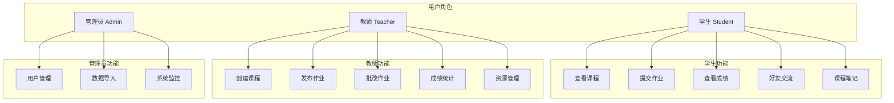

### 2.2 角色权限矩阵

| 功能模块 | 学生 | 教师 | 管理员 |
|----------|------|------|--------|
| 用户注册/登录 | ✓ | ✓ | ✓ |
| 个人信息管理 | ✓ | ✓ | ✓ |
| 创建课程 | ✗ | ✓ | ✓ |
| 加入课程 | ✓ | ✗ | ✗ |
| 发布作业 | ✗ | ✓ | ✗ |
| 提交作业 | ✓ | ✗ | ✗ |
| 批改作业 | ✗ | ✓ | ✗ |
| 查看成绩 | ✓ | ✓ | ✓ |
| 好友系统 | ✓ | ✓ | ✗ |
| 用户管理 | ✗ | ✗ | ✓ |
| 数据导入 | ✗ | ✗ | ✓ |

综合以上三类用户角色的需求分析，系统整体业务流程如下图所示。

**图3.1 系统整体业务流程图**

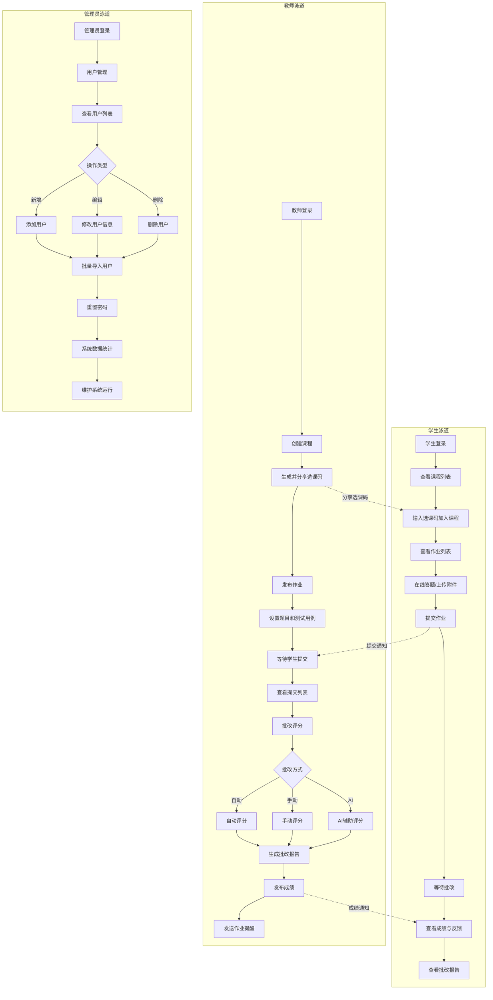

---

## 三、功能需求分析

基于上述功能需求，系统核心的作业批改业务流程如下图所示。

**图3.2 作业批改业务流程图**

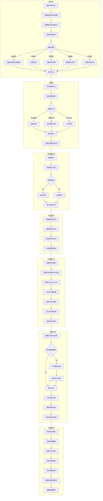

### 3.1 功能模块总览

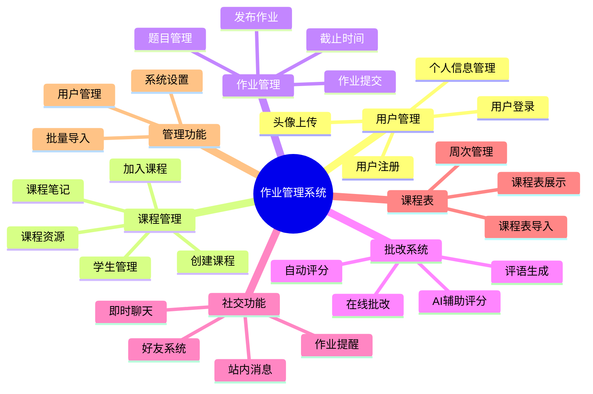

### 3.2 用户管理模块

#### 3.2.1 功能描述

| 功能编号 | 功能名称 | 功能描述 |
|----------|----------|----------|
| UM-001 | 用户注册 | 支持学生、教师注册账号，填写基本信息 |
| UM-002 | 用户登录 | 支持多角色登录，根据角色跳转不同首页 |
| UM-003 | 个人信息管理 | 修改个人信息，包括姓名、联系方式等 |
| UM-004 | 头像上传 | 上传并更新个人头像 |
| UM-005 | 密码管理 | 修改登录密码 |

#### 3.2.2 用户登录流程图

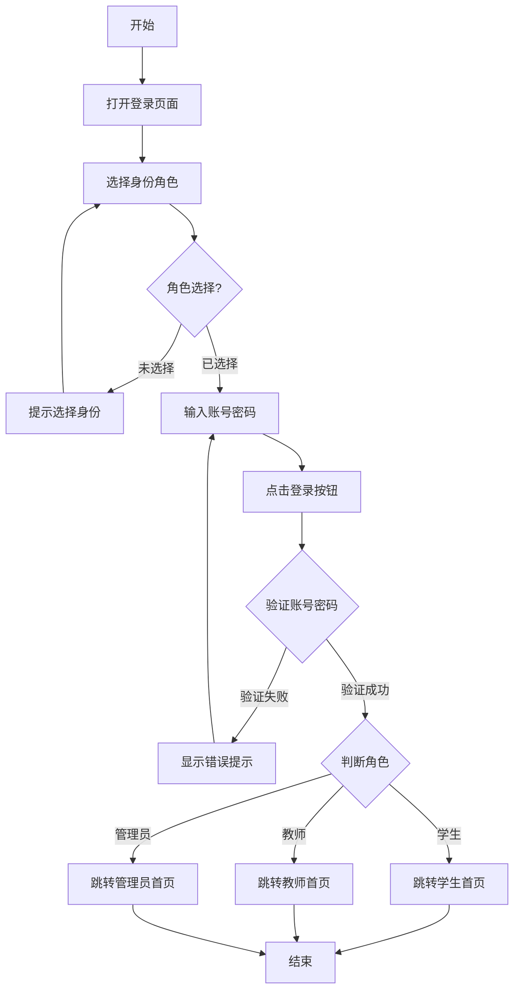

#### 3.2.3 用户注册流程图

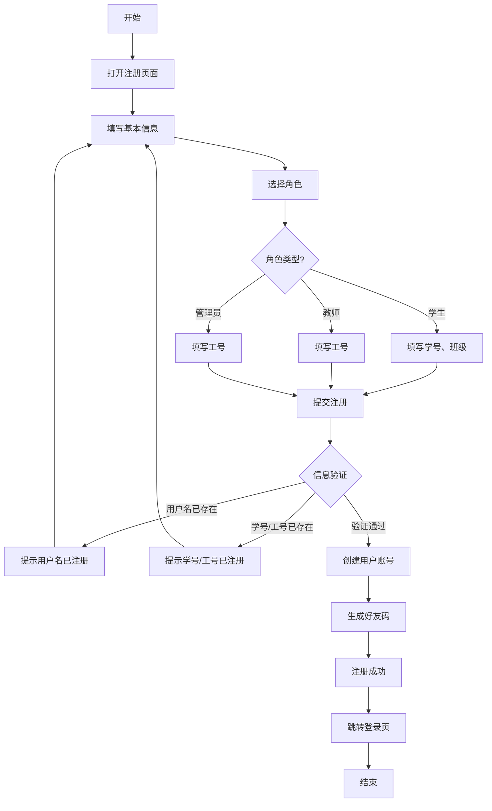

### 3.3 课程管理模块

#### 3.3.1 功能描述

| 功能编号 | 功能名称 | 功能描述 |
|----------|----------|----------|
| CM-001 | 创建课程 | 教师创建课程，生成选课码 |
| CM-002 | 加入课程 | 学生通过选课码加入课程 |
| CM-003 | 课程资源管理 | 教师上传课程资源，学生下载 |
| CM-004 | 课程笔记 | 学生记录课程学习笔记 |
| CM-005 | 学生列表 | 教师查看课程学生名单 |
| CM-006 | 重置选课码 | 教师重置课程选课码 |

#### 3.3.2 课程创建流程图

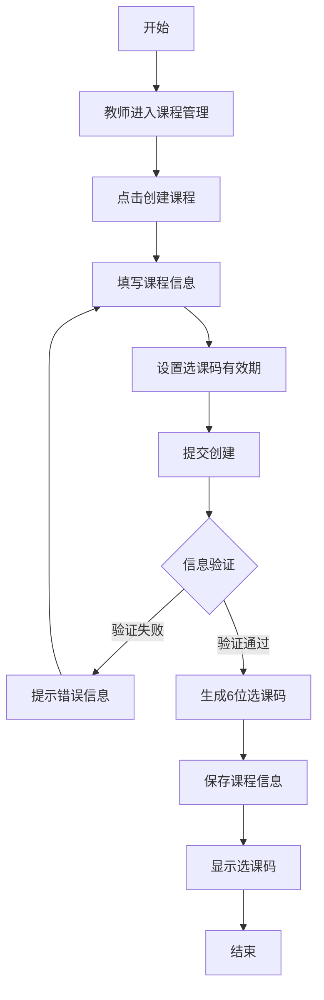

#### 3.3.3 学生选课流程图

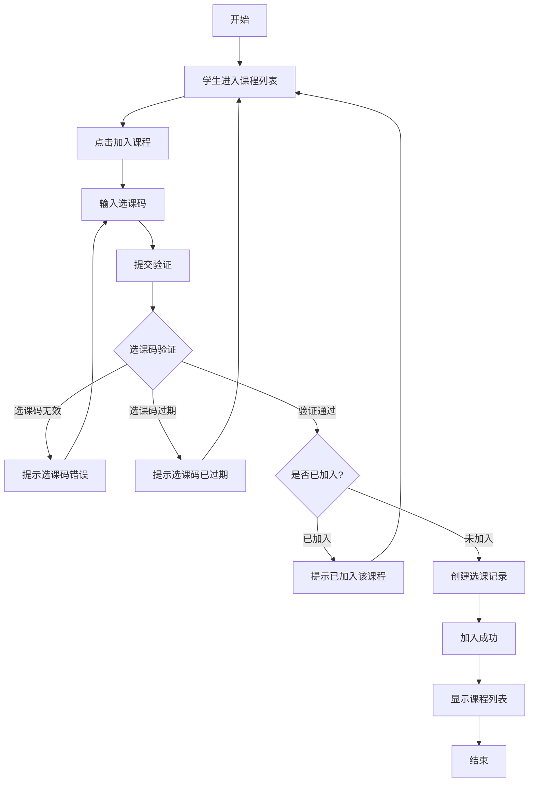

### 3.4 作业管理模块

#### 3.4.1 功能描述

| 功能编号 | 功能名称 | 功能描述 |
|----------|----------|----------|
| AM-001 | 发布作业 | 教师发布新作业，设置截止时间 |
| AM-002 | 题目管理 | 添加、编辑、删除作业题目 |
| AM-003 | 题目导入 | 支持Excel、文本、AI解析导入题目 |
| AM-004 | 作业提交 | 学生在线答题并提交作业 |
| AM-005 | 附件上传 | 支持上传文件作为作业附件 |
| AM-006 | 作业查看 | 查看作业详情和提交状态 |

#### 3.4.2 教师发布作业流程图

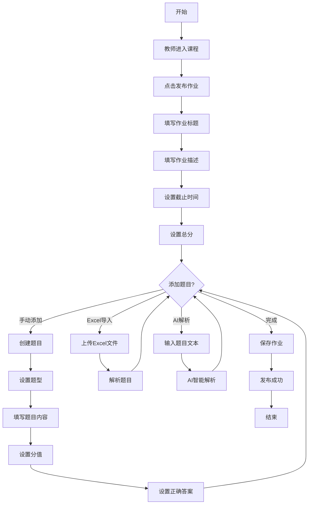

#### 3.4.3 学生提交作业流程图

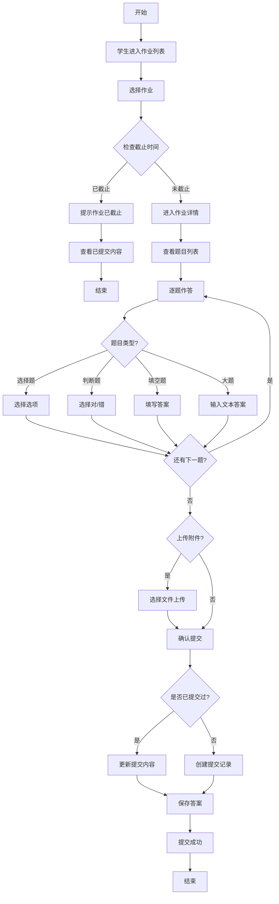

### 3.5 批改系统模块

#### 3.5.1 功能描述

| 功能编号 | 功能名称 | 功能描述 |
|----------|----------|----------|
| GM-001 | 查看提交列表 | 教师查看学生提交列表 |
| GM-002 | 在线批改 | 逐题批改，给出分数和反馈 |
| GM-003 | 自动评分 | 选择题、判断题自动评分 |
| GM-004 | AI辅助评分 | AI辅助批改主观题 |
| GM-005 | 评语生成 | AI自动生成总体评语 |
| GM-006 | 成绩统计 | 查看作业成绩统计 |

#### 3.5.2 教师批改作业流程图

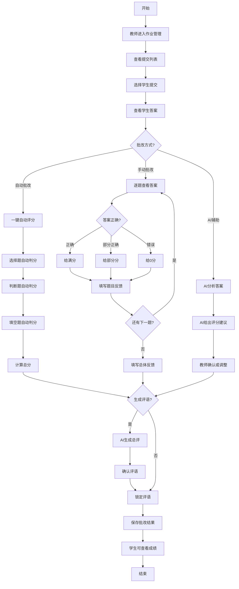

#### 3.5.3 AI辅助评分流程图

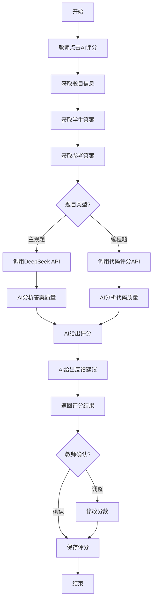

### 3.6 社交功能模块

#### 3.6.1 功能描述

| 功能编号 | 功能名称 | 功能描述 |
|----------|----------|----------|
| SF-001 | 添加好友 | 通过好友码添加好友 |
| SF-002 | 好友列表 | 查看好友列表和状态 |
| SF-003 | 即时聊天 | 与好友进行即时消息聊天 |
| SF-004 | 文件传输 | 聊天中发送文件 |
| SF-005 | 站内消息 | 接收系统通知和作业提醒 |
| SF-006 | 作业提醒 | 教师向未提交学生发送提醒 |

#### 3.6.2 添加好友流程图

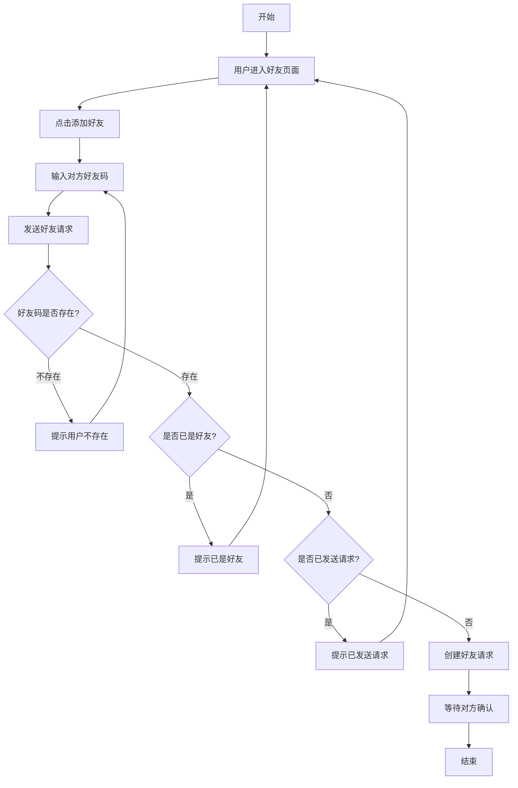

#### 3.6.3 即时聊天流程图

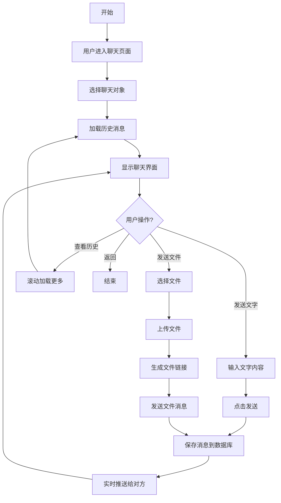

### 3.7 管理员模块

#### 3.7.1 功能描述

| 功能编号 | 功能名称 | 功能描述 |
|----------|----------|----------|
| AD-001 | 用户管理 | 查看、编辑、删除用户 |
| AD-002 | 批量导入 | 批量导入学生/教师账号 |
| AD-003 | 密码重置 | 重置用户密码 |
| AD-004 | 数据统计 | 查看系统数据统计 |
| AD-005 | 课程表管理 | 管理课程表数据 |

#### 3.7.2 批量导入用户流程图

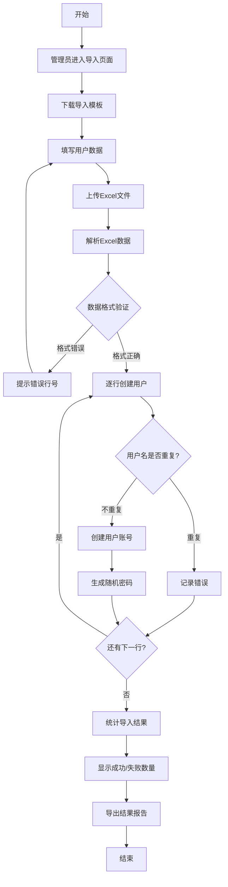

---

## 四、用例图

### 4.1 系统总体用例图

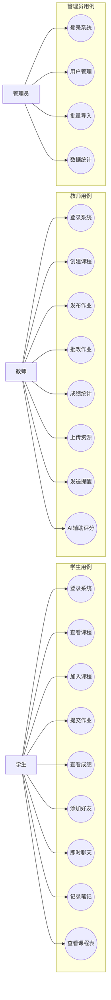

### 4.2 作业管理用例图

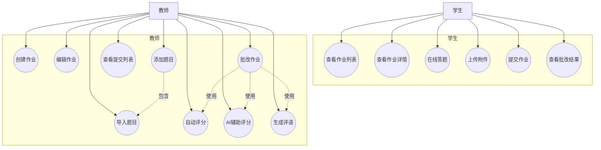

### 4.3 用例描述表

#### 用例：学生提交作业

| 项目 | 内容 |
|------|------|
| 用例名称 | 学生提交作业 |
| 用例编号 | UC-S-004 |
| 参与者 | 学生 |
| 前置条件 | 1. 学生已登录系统 2. 学生已加入课程 3. 作业未截止 |
| 后置条件 | 系统保存学生提交记录 |
| 主成功场景 | 1. 学生进入课程作业列表 2. 选择要提交的作业 3. 查看作业题目 4. 逐题作答 5. 可选上传附件 6. 点击提交 7. 系统保存提交记录 8. 显示提交成功 |
| 扩展场景 | 4a. 学生已提交过：系统更新提交内容 6a. 作业已截止：系统提示无法提交 |
| 特殊需求 | 支持断点续答，答案实时保存 |

#### 用例：教师批改作业

| 项目 | 内容 |
|------|------|
| 用例名称 | 教师批改作业 |
| 用例编号 | UC-T-006 |
| 参与者 | 教师 |
| 前置条件 | 1. 教师已登录系统 2. 教师已创建作业 3. 有学生已提交作业 |
| 后置条件 | 学生可查看批改结果 |
| 主成功场景 | 1. 教师进入作业管理 2. 查看提交列表 3. 选择学生提交 4. 查看学生答案 5. 逐题评分并填写反馈 6. 填写总体评语 7. 保存批改结果 |
| 扩展场景 | 5a. 使用自动评分：系统自动评分选择题 5b. 使用AI辅助：AI给出评分建议 6a. AI生成评语：系统自动生成评语 |
| 特殊需求 | 支持批量批改，支持评语锁定 |

---

## 五、数据流图

### 5.1 顶层数据流图（DFD-0）

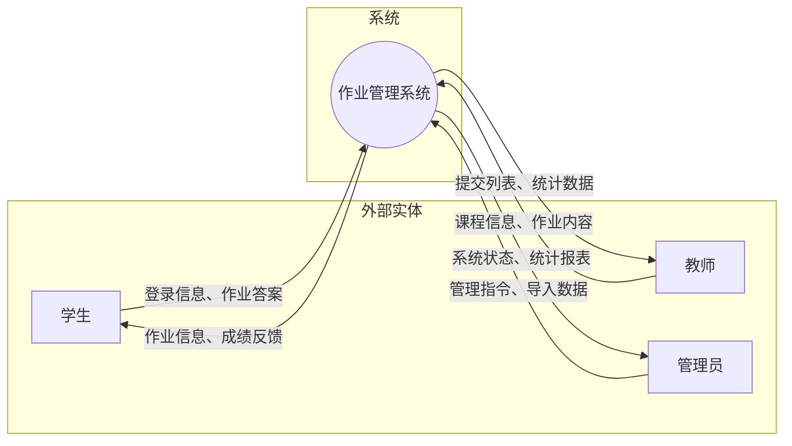

### 5.2 一层数据流图（DFD-1）

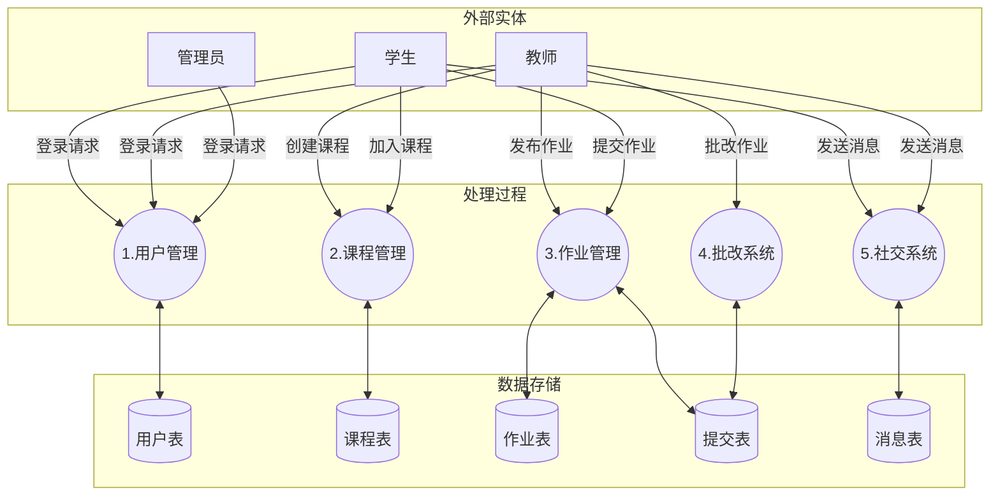

### 5.3 作业管理数据流图（DFD-2）

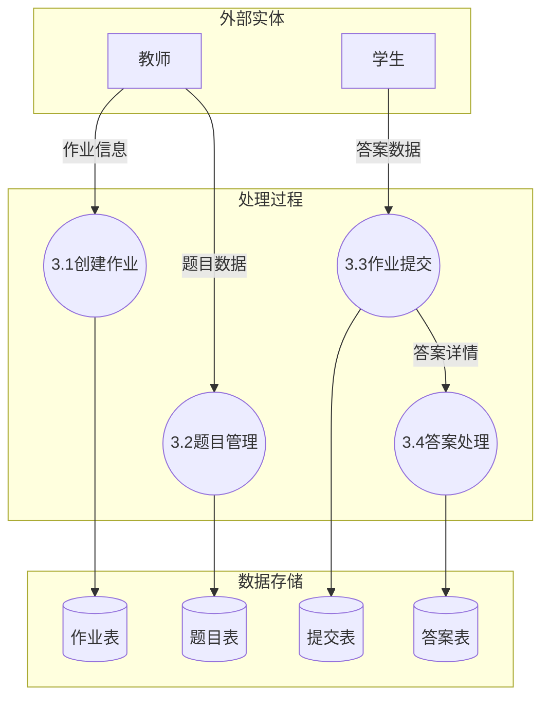

---

## 六、非功能需求

### 6.1 性能需求

| 编号 | 需求描述 | 指标要求 |
|------|----------|----------|
| NFR-001 | 页面响应时间 | 普通页面加载时间不超过2秒 |
| NFR-002 | 接口响应时间 | API接口响应时间不超过1秒 |
| NFR-003 | 并发用户数 | 系统支持至少100个用户同时在线 |
| NFR-004 | 文件上传 | 支持单文件最大50MB上传 |

### 6.2 安全需求

| 编号 | 需求描述 |
|------|----------|
| NFR-005 | 用户密码采用加密存储（bcrypt） |
| NFR-006 | 使用JWT Token进行身份认证 |
| NFR-007 | API接口需要进行权限验证 |
| NFR-008 | 防止SQL注入和XSS攻击 |
| NFR-009 | 敏感操作需要二次确认 |

### 6.3 可用性需求

| 编号 | 需求描述 |
|------|----------|
| NFR-010 | 界面简洁友好，符合用户操作习惯 |
| NFR-011 | 提供操作提示和错误反馈 |
| NFR-012 | 支持主流浏览器（Chrome、Firefox、Edge） |
| NFR-013 | 响应式设计，支持不同屏幕尺寸 |

### 6.4 可维护性需求

| 编号 | 需求描述 |
|------|----------|
| NFR-014 | 代码结构清晰，遵循编码规范 |
| NFR-015 | 提供必要的代码注释 |
| NFR-016 | 模块化设计，便于功能扩展 |
| NFR-017 | 提供系统日志记录 |

---

## 七、系统界面需求

### 7.1 界面清单

| 界面编号 | 界面名称 | 用户角色 |
|----------|----------|----------|
| UI-001 | 登录页面 | 全部 |
| UI-002 | 注册页面 | 全部 |
| UI-003 | 学生首页 | 学生 |
| UI-004 | 学生课程列表 | 学生 |
| UI-005 | 学生作业详情 | 学生 |
| UI-006 | 学生成绩查看 | 学生 |
| UI-007 | 教师首页 | 教师 |
| UI-008 | 教师课程管理 | 教师 |
| UI-009 | 教师作业管理 | 教师 |
| UI-010 | 教师批改页面 | 教师 |
| UI-011 | 管理员首页 | 管理员 |
| UI-012 | 用户管理页面 | 管理员 |
| UI-013 | 聊天页面 | 学生、教师 |
| UI-014 | 个人中心 | 全部 |

### 7.2 核心界面原型说明

#### 登录页面
- 顶部显示系统Logo
- 身份选择按钮（学生/教师/管理员）
- 账号密码输入框
- 登录按钮
- 注册链接
- 测试账号提示信息

#### 学生作业详情页
- 作业标题和截止时间
- 作业描述
- 题目列表（支持不同题型展示）
- 答题区域
- 附件上传区域
- 提交按钮

#### 教师批改页面
- 学生信息展示
- 题目和学生答案对照
- 评分区域
- 反馈输入框
- 自动评分/AI评分按钮
- 总评语生成按钮

---

## 八、接口需求

### 8.1 外部接口

| 接口名称 | 接口类型 | 说明 |
|----------|----------|------|
| DeepSeek API | HTTP API | AI辅助评分、题目解析 |
| 文件存储 | 本地存储 | 用户上传文件存储 |

### 8.2 内部接口

系统采用RESTful API设计风格，主要接口包括：

| 模块 | 接口前缀 | 说明 |
|------|----------|------|
| 认证模块 | /api/auth | 登录、注册、个人信息 |
| 课程模块 | /api/courses | 课程CRUD、选课 |
| 作业模块 | /api/assignments | 作业管理、提交 |
| 好友模块 | /api/friends | 好友管理 |
| 聊天模块 | /api/chats | 即时聊天 |
| 管理模块 | /api/admin | 系统管理 |

---

## 九、约束与假设

### 9.1 约束条件

| 编号 | 约束描述 |
|------|----------|
| CON-001 | 系统基于B/S架构，需要浏览器访问 |
| CON-002 | 后端使用Python Flask框架 |
| CON-003 | 前端使用Vue.js框架 |
| CON-004 | 数据库使用SQLite |
| CON-005 | AI功能依赖DeepSeek API |

### 9.2 假设条件

| 编号 | 假设描述 |
|------|----------|
| ASM-001 | 用户具备基本的计算机操作能力 |
| ASM-002 | 用户使用现代浏览器访问系统 |
| ASM-003 | 网络环境稳定可靠 |
| ASM-004 | AI服务可用且响应及时 |

---

## 十、附录

### 10.1 术语表

| 术语 | 定义 |
|------|------|
| 课程码 | 教师创建课程时生成的6位选课码 |
| 好友码 | 用户注册时生成的8位唯一标识码 |
| AI评分 | 使用人工智能技术辅助批改主观题 |
| 自动评分 | 系统根据预设答案自动评分 |

### 10.2 参考文档

| 文档名称 | 说明 |
|----------|------|
| 数据库设计文档 | 系统数据库表结构设计 |
| 接口设计文档 | 系统API接口详细设计 |
| 用户操作手册 | 系统使用说明 |

### 10.3 绘图工具推荐

| 工具名称 | 网址 | 适用场景 |
|----------|------|----------|
| ProcessOn | https://www.processon.com | 流程图、用例图 |
| draw.io | https://app.diagrams.net | 各类图表 |
| Mermaid Live | https://mermaid.live | Mermaid在线编辑 |
| StarUML | https://staruml.io | UML建模 |
