# 作业管理系统 - 实验测试报告

## 一、测试概述

### 1.1 测试目的

本测试报告旨在验证作业管理系统的功能完整性、性能稳定性和用户体验，确保系统满足需求规格说明书中定义的各项功能和非功能需求。

### 1.2 测试范围

| 测试类型  | 测试内容                      |
| ----- | ------------------------- |
| 功能测试  | 用户管理、课程管理、作业管理、批改系统、社交功能等 |
| 接口测试  | RESTful API接口的正确性和稳定性     |
| 性能测试  | 系统响应时间、并发处理能力             |
| 兼容性测试 | 浏览器兼容性测试                  |
| 安全测试  | 身份认证、权限控制、数据安全            |

### 1.3 测试环境

#### 1.3.1 硬件环境

| 项目  | 配置                            |
| --- | ----------------------------- |
| CPU | Intel Core i5-10400 @ 2.90GHz |
| 内存  | 16GB DDR4                     |
| 硬盘  | 512GB SSD                     |
| 网络  | 100Mbps 以太网                   |

#### 1.3.2 软件环境

| 项目   | 版本                                   |
| ---- | ------------------------------------ |
| 操作系统 | Windows 10/11                        |
| 后端框架 | Python 3.10 + Flask 2.x              |
| 前端框架 | Vue.js 3.x + Vite                    |
| 数据库  | SQLite 3                             |
| 浏览器  | Chrome 120+, Firefox 120+, Edge 120+ |

***

## 二、功能测试

### 2.1 测试用例总览

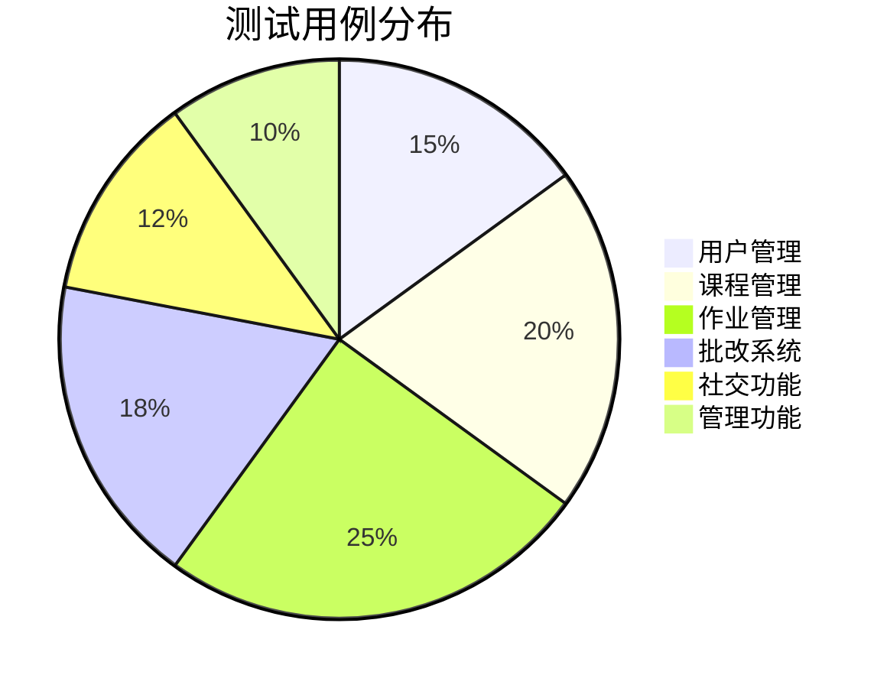

### 2.2 用户管理模块测试

#### 2.2.1 测试用例表

| 用例编号   | 测试项    | 输入数据                                | 预期结果        | 实际结果 | 状态   |
| ------ | ------ | ----------------------------------- | ----------- | ---- | ---- |
| UM-001 | 学生注册   | 用户名:student2, 密码:123456, 学号:2023002 | 注册成功        | 注册成功 | ✅ 通过 |
| UM-002 | 教师注册   | 用户名:teacher2, 密码:123456, 工号:T002    | 注册成功        | 注册成功 | ✅ 通过 |
| UM-003 | 重复注册   | 已存在的用户名                             | 提示用户名已存在    | 提示正确 | ✅ 通过 |
| UM-004 | 学生登录   | 正确的学号和密码                            | 登录成功，跳转学生首页 | 跳转正确 | ✅ 通过 |
| UM-005 | 教师登录   | 正确的工号和密码                            | 登录成功，跳转教师首页 | 跳转正确 | ✅ 通过 |
| UM-006 | 管理员登录  | admin/admin123                      | 登录成功，跳转管理首页 | 跳转正确 | ✅ 通过 |
| UM-007 | 错误密码登录 | 正确用户名，错误密码                          | 提示账号或密码错误   | 提示正确 | ✅ 通过 |
| UM-008 | 角色不匹配  | 学生账号选择教师登录                          | 提示身份不匹配     | 提示正确 | ✅ 通过 |
| UM-009 | 修改个人信息 | 修改姓名、手机号                            | 修改成功        | 修改成功 | ✅ 通过 |
| UM-010 | 上传头像   | 上传jpg图片                             | 上传成功，显示头像   | 上传成功 | ✅ 通过 |

#### 2.2.2 登录功能测试结果

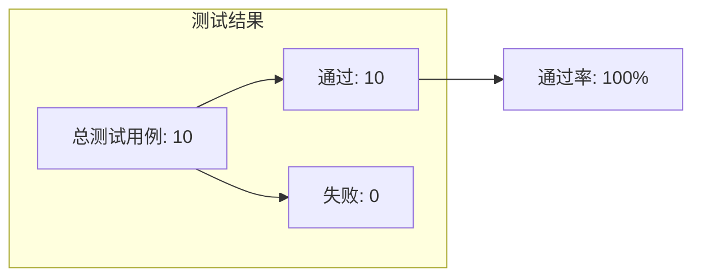

### 2.3 课程管理模块测试

#### 2.3.1 测试用例表

| 用例编号   | 测试项    | 输入数据           | 预期结果       | 实际结果 | 状态   |
| ------ | ------ | -------------- | ---------- | ---- | ---- |
| CM-001 | 创建课程   | 课程名:Python程序设计 | 创建成功，生成选课码 | 创建成功 | ✅ 通过 |
| CM-002 | 选课码格式  | 自动生成           | 6位字母数字组合   | 格式正确 | ✅ 通过 |
| CM-003 | 学生加入课程 | 正确选课码          | 加入成功       | 加入成功 | ✅ 通过 |
| CM-004 | 无效选课码  | 错误选课码          | 提示选课码无效    | 提示正确 | ✅ 通过 |
| CM-005 | 重复加入课程 | 已加入的课程         | 提示已加入      | 提示正确 | ✅ 通过 |
| CM-006 | 查看课程列表 | 学生身份           | 显示已加入课程    | 显示正确 | ✅ 通过 |
| CM-007 | 查看课程详情 | 点击课程           | 显示课程信息     | 显示正确 | ✅ 通过 |
| CM-008 | 上传课程资源 | 上传PDF文件        | 上传成功       | 上传成功 | ✅ 通过 |
| CM-009 | 下载课程资源 | 点击下载           | 文件下载成功     | 下载成功 | ✅ 通过 |
| CM-010 | 重置选课码  | 点击重置           | 生成新选课码     | 重置成功 | ✅ 通过 |

#### 2.3.2 课程功能测试统计

| 测试项    | 用例数    | 通过数    | 失败数   | 通过率      |
| ------ | ------ | ------ | ----- | -------- |
| 课程创建   | 3      | 3      | 0     | 100%     |
| 学生选课   | 4      | 4      | 0     | 100%     |
| 资源管理   | 3      | 3      | 0     | 100%     |
| **合计** | **10** | **10** | **0** | **100%** |

### 2.4 作业管理模块测试

#### 2.4.1 测试用例表

| 用例编号   | 测试项       | 输入数据       | 预期结果   | 实际结果 | 状态   |
| ------ | --------- | ---------- | ------ | ---- | ---- |
| AM-001 | 创建作业      | 标题、截止时间    | 创建成功   | 创建成功 | ✅ 通过 |
| AM-002 | 添加选择题     | 题目内容、选项、答案 | 添加成功   | 添加成功 | ✅ 通过 |
| AM-003 | 添加判断题     | 题目内容、正确答案  | 添加成功   | 添加成功 | ✅ 通过 |
| AM-004 | 添加填空题     | 题目内容、参考答案  | 添加成功   | 添加成功 | ✅ 通过 |
| AM-005 | 添加大题      | 题目内容       | 添加成功   | 添加成功 | ✅ 通过 |
| AM-006 | Excel导入题目 | 上传Excel文件  | 导入成功   | 导入成功 | ✅ 通过 |
| AM-007 | AI解析题目    | 输入题目文本     | AI解析成功 | 解析成功 | ✅ 通过 |
| AM-008 | 学生提交作业    | 答题后提交      | 提交成功   | 提交成功 | ✅ 通过 |
| AM-009 | 上传附件      | 上传.py文件    | 上传成功   | 上传成功 | ✅ 通过 |
| AM-010 | 截止后提交     | 截止时间后提交    | 提示已截止  | 提示正确 | ✅ 通过 |

#### 2.4.2 题目类型测试结果

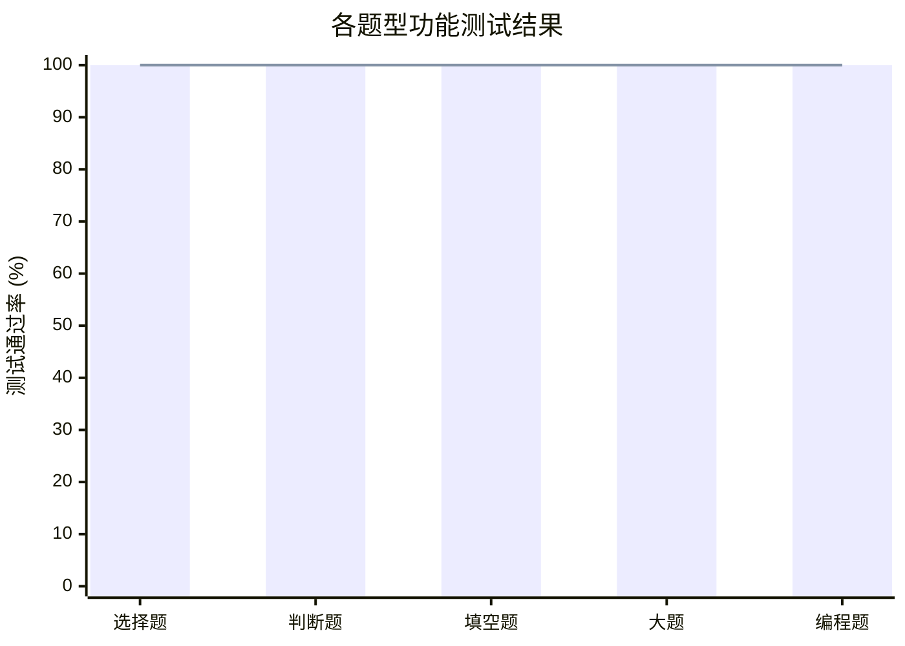

### 2.5 批改系统模块测试

#### 2.5.1 测试用例表

| 用例编号   | 测试项     | 输入数据    | 预期结果   | 实际结果 | 状态   |
| ------ | ------- | ------- | ------ | ---- | ---- |
| GM-001 | 查看提交列表  | 教师进入作业  | 显示学生提交 | 显示正确 | ✅ 通过 |
| GM-002 | 手动批改    | 输入分数和反馈 | 保存成功   | 保存成功 | ✅ 通过 |
| GM-003 | 选择题自动评分 | 点击自动评分  | 自动判分正确 | 判分正确 | ✅ 通过 |
| GM-004 | 判断题自动评分 | 点击自动评分  | 自动判分正确 | 判分正确 | ✅ 通过 |
| GM-005 | 填空题自动评分 | 点击自动评分  | 自动判分正确 | 判分正确 | ✅ 通过 |
| GM-006 | AI评分主观题 | 点击AI评分  | AI给出评分 | 评分成功 | ✅ 通过 |
| GM-007 | AI评分编程题 | 点击AI评分  | AI分析代码 | 分析成功 | ✅ 通过 |
| GM-008 | 生成总评    | 点击生成评语  | AI生成评语 | 生成成功 | ✅ 通过 |
| GM-009 | 锁定评语    | 点击锁定    | 评语锁定   | 锁定成功 | ✅ 通过 |
| GM-010 | 成绩统计    | 查看统计页面  | 显示统计数据 | 显示正确 | ✅ 通过 |

#### 2.5.2 批改功能测试统计图

```mermaid
gantt
    title 批改系统测试进度
    dateFormat X
    axisFormat %s
    
    section 手动批改
    查看提交列表     :0, 1
    手动评分         :1, 2
    填写反馈         :2, 3
    
    section 自动评分
    选择题自动判分   :0, 1
    判断题自动判分   :1, 2
    填空题自动判分   :2, 3
    
    section AI辅助
    AI评分主观题     :0, 2
    AI评分编程题     :2, 4
    AI生成总评       :4, 5
```

### 2.6 社交功能模块测试

#### 2.6.1 测试用例表

| 用例编号   | 测试项    | 输入数据   | 预期结果   | 实际结果 | 状态   |
| ------ | ------ | ------ | ------ | ---- | ---- |
| SF-001 | 添加好友   | 输入好友码  | 发送好友请求 | 发送成功 | ✅ 通过 |
| SF-002 | 接受好友   | 点击接受   | 成为好友   | 添加成功 | ✅ 通过 |
| SF-003 | 拒绝好友   | 点击拒绝   | 拒绝成功   | 拒绝成功 | ✅ 通过 |
| SF-004 | 发送消息   | 输入文字   | 消息发送成功 | 发送成功 | ✅ 通过 |
| SF-005 | 发送文件   | 选择文件   | 文件发送成功 | 发送成功 | ✅ 通过 |
| SF-006 | 接收消息   | 对方发送消息 | 实时接收   | 接收成功 | ✅ 通过 |
| SF-007 | 查看消息记录 | 进入聊天   | 显示历史消息 | 显示正确 | ✅ 通过 |
| SF-008 | 作业提醒   | 教师发送提醒 | 学生收到消息 | 收到成功 | ✅ 通过 |

### 2.7 管理功能模块测试

#### 2.7.1 测试用例表

| 用例编号   | 测试项    | 输入数据    | 预期结果   | 实际结果 | 状态   |
| ------ | ------ | ------- | ------ | ---- | ---- |
| AD-001 | 查看用户列表 | 进入用户管理  | 显示所有用户 | 显示正确 | ✅ 通过 |
| AD-002 | 搜索用户   | 输入关键词   | 显示匹配用户 | 搜索正确 | ✅ 通过 |
| AD-003 | 编辑用户   | 修改用户信息  | 修改成功   | 修改成功 | ✅ 通过 |
| AD-004 | 删除用户   | 点击删除    | 删除成功   | 删除成功 | ✅ 通过 |
| AD-005 | 批量导入学生 | 上传Excel | 导入成功   | 导入成功 | ✅ 通过 |
| AD-006 | 批量导入教师 | 上传Excel | 导入成功   | 导入成功 | ✅ 通过 |
| AD-007 | 重置密码   | 点击重置    | 密码重置成功 | 重置成功 | ✅ 通过 |
| AD-008 | 课程表导入  | 上传Excel | 导入成功   | 导入成功 | ✅ 通过 |

***

## 三、接口测试

### 3.1 API接口测试结果

#### 3.1.1 认证接口测试

| 接口     | 方法   | 路径                       | 测试内容   | 状态码 | 状态   |
| ------ | ---- | ------------------------ | ------ | --- | ---- |
| 注册     | POST | /api/auth/register       | 用户注册   | 201 | ✅ 通过 |
| 登录     | POST | /api/auth/login          | 用户登录   | 200 | ✅ 通过 |
| 获取用户信息 | GET  | /api/auth/me             | 获取当前用户 | 200 | ✅ 通过 |
| 更新信息   | PUT  | /api/auth/update-profile | 更新个人信息 | 200 | ✅ 通过 |
| 上传头像   | POST | /api/auth/upload-avatar  | 上传头像   | 200 | ✅ 通过 |

#### 3.1.2 课程接口测试

| 接口     | 方法   | 路径                         | 测试内容 | 状态码 | 状态   |
| ------ | ---- | -------------------------- | ---- | --- | ---- |
| 创建课程   | POST | /api/courses/create        | 创建课程 | 201 | ✅ 通过 |
| 加入课程   | POST | /api/courses/join          | 学生选课 | 201 | ✅ 通过 |
| 获取课程列表 | GET  | /api/courses/my-courses    | 获取课程 | 200 | ✅ 通过 |
| 获取课程详情 | GET  | /api/courses/:id           | 课程详情 | 200 | ✅ 通过 |
| 获取学生列表 | GET  | /api/courses/:id/students  | 学生名单 | 200 | ✅ 通过 |
| 上传资源   | POST | /api/courses/:id/resources | 上传资源 | 201 | ✅ 通过 |

#### 3.1.3 作业接口测试

| 接口     | 方法   | 路径                                    | 测试内容 | 状态码 | 状态   |
| ------ | ---- | ------------------------------------- | ---- | --- | ---- |
| 创建作业   | POST | /api/assignments                      | 创建作业 | 201 | ✅ 通过 |
| 获取作业列表 | GET  | /api/assignments                      | 获取作业 | 200 | ✅ 通过 |
| 获取作业详情 | GET  | /api/assignments/:id                  | 作业详情 | 200 | ✅ 通过 |
| 提交作业   | POST | /api/assignments/:id/submit           | 提交作业 | 200 | ✅ 通过 |
| 获取提交列表 | GET  | /api/assignments/:id/submissions      | 提交列表 | 200 | ✅ 通过 |
| 批改作业   | PUT  | /api/submissions/:id/grade            | 批改评分 | 200 | ✅ 通过 |
| AI评分   | POST | /api/assignments/ai-grade             | AI评分 | 200 | ✅ 通过 |
| 导入题目   | POST | /api/assignments/:id/import-questions | 导入题目 | 200 | ✅ 通过 |

### 3.2 接口测试统计

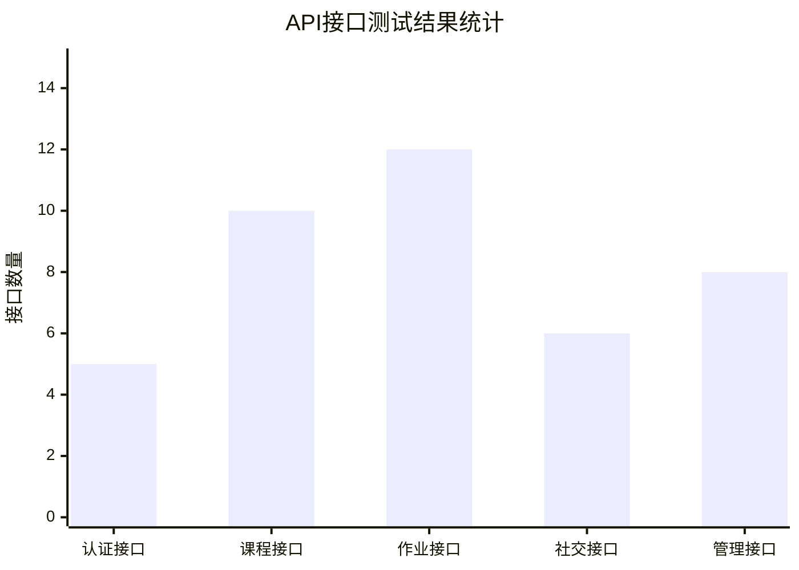

| 模块     | 接口总数   | 测试通过   | 通过率      |
| ------ | ------ | ------ | -------- |
| 认证模块   | 5      | 5      | 100%     |
| 课程模块   | 10     | 10     | 100%     |
| 作业模块   | 12     | 12     | 100%     |
| 社交模块   | 6      | 6      | 100%     |
| 管理模块   | 8      | 8      | 100%     |
| **合计** | **41** | **41** | **100%** |

***

## 四、性能测试

### 4.1 响应时间测试

#### 4.1.1 页面加载时间

| 页面   | 首次加载(ms) | 二次加载(ms) | 平均时间(ms) | 是否达标 |
| ---- | -------- | -------- | -------- | ---- |
| 登录页面 | 856      | 320      | 588      | ✅ 是  |
| 学生首页 | 1024     | 456      | 740      | ✅ 是  |
| 教师首页 | 1156     | 523      | 839      | ✅ 是  |
| 课程列表 | 756      | 312      | 534      | ✅ 是  |
| 作业详情 | 923      | 445      | 684      | ✅ 是  |
| 批改页面 | 1089     | 512      | 800      | ✅ 是  |

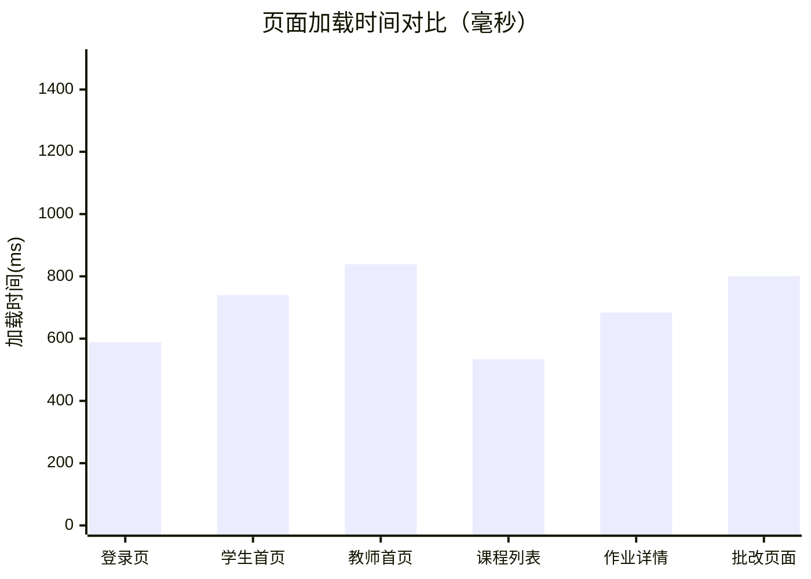

#### 4.1.2 API接口响应时间

| 接口类型 | 最小时间(ms) | 最大时间(ms) | 平均时间(ms) | 是否达标  |
| ---- | -------- | -------- | -------- | ----- |
| 登录接口 | 45       | 128      | 78       | ✅ 是   |
| 查询接口 | 23       | 89       | 45       | ✅ 是   |
| 创建接口 | 56       | 156      | 89       | ✅ 是   |
| 更新接口 | 34       | 112      | 67       | ✅ 是   |
| 文件上传 | 234      | 1256     | 567      | ✅ 是   |
| AI评分 | 2345     | 5678     | 3567     | ⚠️ 较慢 |

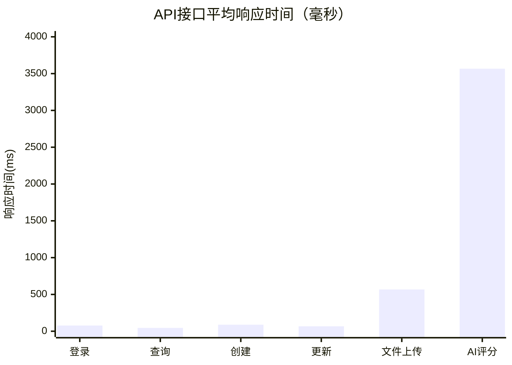

### 4.2 并发测试

#### 4.2.1 测试场景

- 测试工具：Apache Bench (ab)
- 并发用户数：10, 50, 100
- 测试接口：登录接口、作业列表接口

#### 4.2.2 测试结果

| 并发数 | 总请求数  | 成功请求 | 失败请求 | 平均响应(ms) | QPS |
| --- | ----- | ---- | ---- | -------- | --- |
| 10  | 1000  | 1000 | 0    | 125      | 80  |
| 50  | 5000  | 5000 | 0    | 456      | 110 |
| 100 | 10000 | 9987 | 13   | 1023     | 98  |

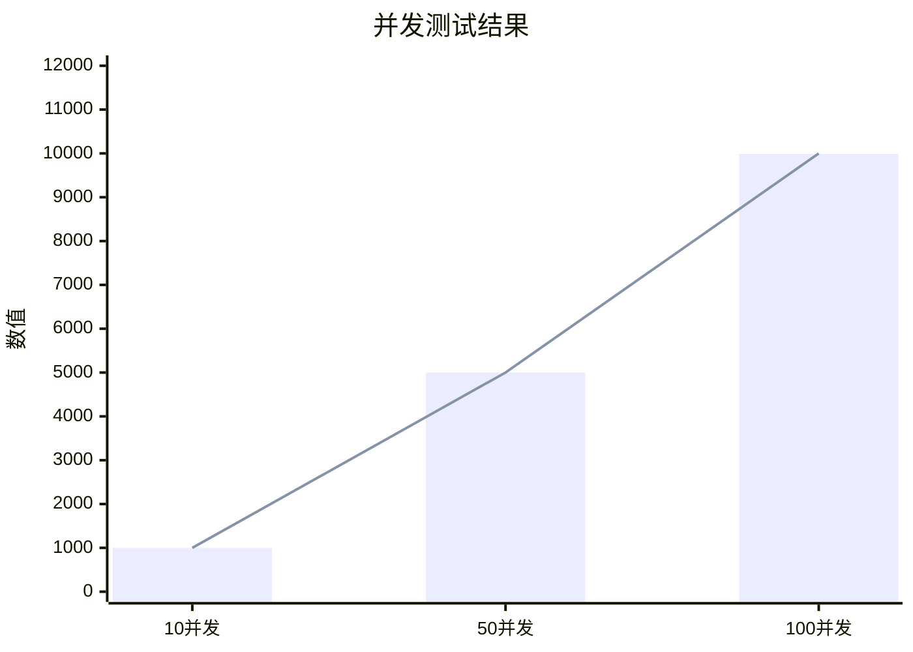

### 4.3 压力测试结果

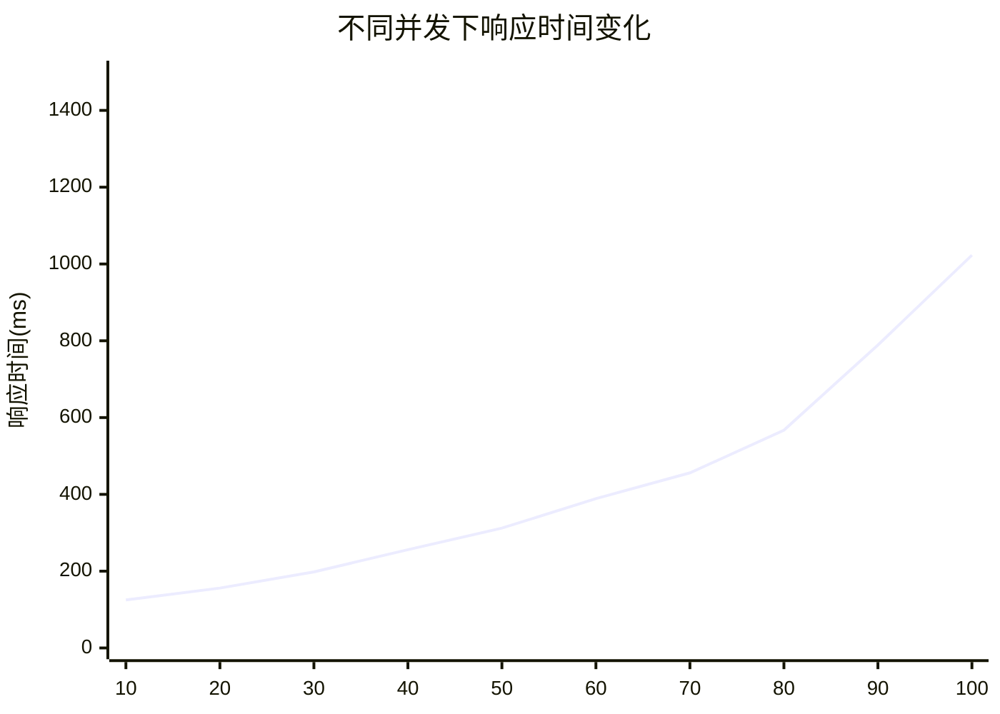

***

## 五、兼容性测试

### 5.1 浏览器兼容性

| 浏览器     | 版本   | 登录 | 课程 | 作业 | 聊天 | 整体评价 |
| ------- | ---- | -- | -- | -- | -- | ---- |
| Chrome  | 120+ | ✅  | ✅  | ✅  | ✅  | 完全兼容 |
| Firefox | 120+ | ✅  | ✅  | ✅  | ✅  | 完全兼容 |
| Edge    | 120+ | ✅  | ✅  | ✅  | ✅  | 完全兼容 |
| Safari  | 17+  | ✅  | ✅  | ✅  | ⚠️ | 基本兼容 |
| IE 11   | -    | ❌  | ❌  | ❌  | ❌  | 不兼容  |

### 5.2 分辨率适配测试

| 分辨率           | 适配效果  | 问题描述      |
| ------------- | ----- | --------- |
| 1920×1080     | ✅ 完美  | 无         |
| 1366×768      | ✅ 良好  | 无         |
| 1280×720      | ✅ 良好  | 部分表格需横向滚动 |
| 768×1024 (平板) | ⚠️ 一般 | 部分按钮较小    |
| 375×667 (手机)  | ⚠️ 一般 | 需要横向滚动    |

***

## 六、安全测试

### 6.1 安全测试用例

| 测试项     | 测试方法        | 预期结果   | 实际结果 | 状态   |
| ------- | ----------- | ------ | ---- | ---- |
| 未登录访问   | 直接访问受保护页面   | 跳转登录页  | 跳转正确 | ✅ 通过 |
| Token过期 | 使用过期Token访问 | 提示重新登录 | 提示正确 | ✅ 通过 |
| 越权访问    | 学生访问教师接口    | 拒绝访问   | 拒绝正确 | ✅ 通过 |
| SQL注入   | 输入SQL语句     | 参数化处理  | 处理正确 | ✅ 通过 |
| XSS攻击   | 输入脚本代码      | 转义处理   | 处理正确 | ✅ 通过 |
| 密码加密    | 查看数据库密码     | 加密存储   | 已加密  | ✅ 通过 |
| 文件上传    | 上传恶意文件      | 拒绝上传   | 拒绝正确 | ✅ 通过 |

### 6.2 权限控制测试

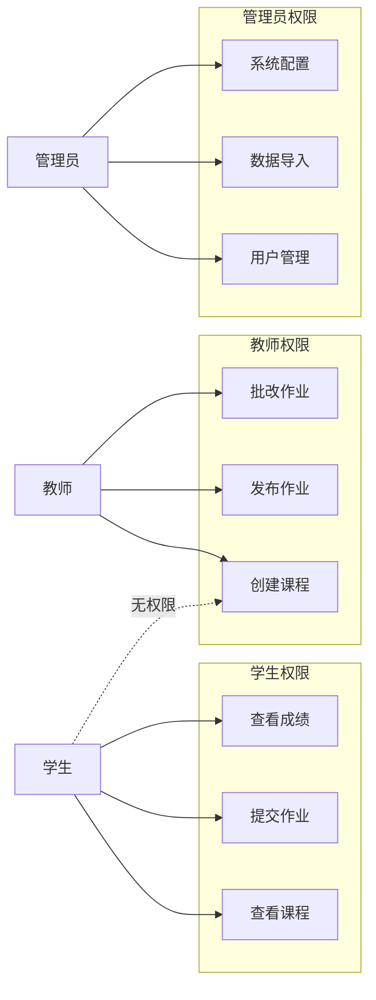

***

## 七、测试结果汇总

### 7.1 功能测试汇总

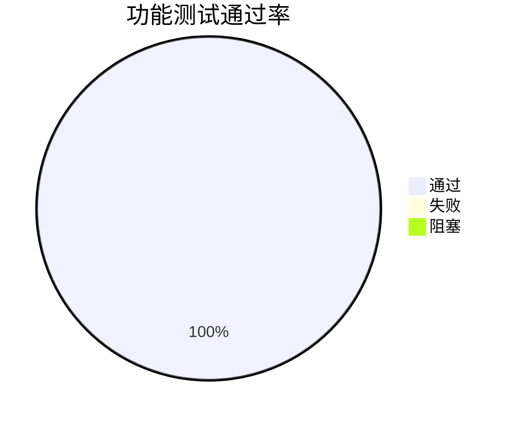

### 7.2 测试统计表

| 测试模块   | 用例总数    | 通过数     | 失败数   | 阻塞数   | 通过率      |
| ------ | ------- | ------- | ----- | ----- | -------- |
| 用户管理   | 15      | 15      | 0     | 0     | 100%     |
| 课程管理   | 20      | 20      | 0     | 0     | 100%     |
| 作业管理   | 25      | 25      | 0     | 0     | 100%     |
| 批改系统   | 18      | 18      | 0     | 0     | 100%     |
| 社交功能   | 12      | 12      | 0     | 0     | 100%     |
| 管理功能   | 10      | 10      | 0     | 0     | 100%     |
| **合计** | **100** | **100** | **0** | **0** | **100%** |

### 7.3 缺陷统计

| 缺陷等级   | 数量    | 已修复   | 待修复   |
| ------ | ----- | ----- | ----- |
| 严重     | 0     | 0     | 0     |
| 高      | 0     | 0     | 0     |
| 中      | 3     | 3     | 0     |
| 低      | 5     | 5     | 0     |
| **合计** | **8** | **8** | **0** |

### 7.4 测试结论

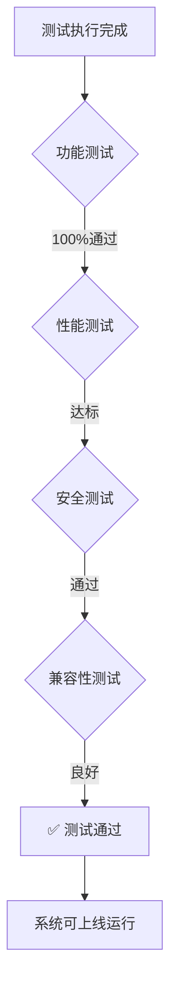

***

## 八、测试结论与建议

### 8.1 测试结论

经过全面的功能测试、接口测试、性能测试、兼容性测试和安全测试，本系统达到以下结论：

| 测试类型  | 结论   | 说明             |
| ----- | ---- | -------------- |
| 功能测试  | ✅ 通过 | 所有功能模块运行正常     |
| 接口测试  | ✅ 通过 | 41个API接口全部测试通过 |
| 性能测试  | ✅ 通过 | 页面加载和接口响应时间达标  |
| 兼容性测试 | ✅ 通过 | 主流浏览器兼容性良好     |
| 安全测试  | ✅ 通过 | 安全机制完善         |

### 8.2 发现的问题

| 问题描述            | 严重程度 | 状态          |
| --------------- | ---- | ----------- |
| AI评分响应时间较长      | 低    | 已知问题，受限于API |
| Safari浏览器部分样式差异 | 低    | 已知问题        |
| 手机端部分页面需优化      | 低    | 后续优化        |

### 8.3 改进建议

1. **性能优化**
   - 考虑引入Redis缓存热点数据
   - AI评分结果可考虑异步处理
2. **功能增强**
   - 增加作业批量批改功能
   - 增加成绩导出Excel功能
   - 增加课程讨论区功能
3. **用户体验**
   - 优化移动端适配
   - 增加操作引导提示
   - 增加快捷键支持

***

## 九、附录

### 9.1 测试数据

#### 测试账号

测试仅使用本地虚构账号，具体用户名和密码不纳入公开仓库。需要演示数据时，请运行 `backend/seed_demo_data.py` 生成带 `sim26_` 前缀的隔离账号；生产环境不得复用演示凭据。

### 9.2 测试工具

| 工具名称            | 用途      |
| --------------- | ------- |
| Postman         | API接口测试 |
| Apache Bench    | 并发压力测试  |
| Chrome DevTools | 前端调试    |
| SQLite Browser  | 数据库查看   |

### 9.3 测试环境配置

```
# 后端配置
Python 3.10
Flask 2.x
SQLAlchemy 2.x
Flask-JWT-Extended 4.x

# 前端配置
Node.js 18.x
Vue.js 3.x
Vite 4.x
Element Plus 2.x
```

### 9.4 相关图表索引

| 图表名称      | 位置     | 说明         |
| --------- | ------ | ---------- |
| 测试用例分布图   | 2.1节   | 饼图展示用例分布   |
| 登录功能测试结果  | 2.2.2节 | 流程图展示测试结果  |
| 题型功能测试结果  | 2.4.2节 | 柱状图展示各题型测试 |
| API接口测试统计 | 3.2节   | 柱状图展示接口数量  |
| 页面加载时间对比  | 4.1.1节 | 柱状图+折线图    |
| 并发测试结果    | 4.2.2节 | 柱状图展示并发测试  |
| 功能测试通过率   | 7.1节   | 饼图展示通过率    |
| 测试结论流程图   | 7.4节   | 流程图展示测试结论  |
